# AntSync

AntSync是文件同步工具，支持本地和OSS、FTP、WebDav等云端之间进行文件同步。它具有以下特性：

* 跨平台支持，仅需安装Java即可运行
* Web优先，支持通过浏览器查看运行情况、新增修改配置
* 支持多种云端，包含腾讯云COS、Minio、AwsS3、FTP和WebDav
* 支持RSA+AES加密上传，避免内容泄露。（目前仅支持OSS类云端）

## 1. 下载

[点击这里](https://www.github.com/jiangmitiao/AntSync/releases)下载最新版本，如果你使用的平台没有安装java，或者你不会安装Java，建议使用Docker进行后续操作。


## 2. 启动

AntSync在启动后，会在启动目录下创建一些文件和文件夹：

* `config.json`：用于持久化配置信息，如果启动目录下没有该文件，则启动时会默认创建该文件
* `gc.log`：用于记录系统内存回收情况
* `log/`：用于记录同步任务运行及文件同步情况
* `.session/`：用于web登陆会话持久化
* `.cloudsync/`：用于同步任务文件信息缓存

由于AntSync会在启动目录下创建上述文件，为了防止污染你的文件夹，因此最好将`AntSync.jar`转移到一个新的文件夹中。

### Java直接运行

目前仅支持**JDK8**

```java
JAVA_OPTS="-server -Xmx2048m -Xms2048m -XX:+UseG1GC -XX:+PrintGCDetails -XX:+PrintGCTimeStamps -XX:+PrintGCDateStamps -XX:+PrintHeapAtGC -Xloggc:gc.log"
eval java "$JAVA_OPTS" -jar AntSync.jar
```

### 通过Docker运行

```shell
DATA_PATH="数据文件夹路径"
WORK_PATH="AntSync.jar所在目录"
docker run -d \
-w "/antsync" \
-e "JAVA_OPTS=-server -Xmx2048m -Xms2048m -XX:+UseG1GC -XX:+PrintGCDetails -XX:+PrintGCTimeStamps -XX:+PrintGCDateStamps -XX:+PrintHeapAtGC -Xloggc:gc.log" \
-e "TZ=Asia/Shanghai" \
--net="bridge" \
-p 9900:9900 \
-v $DATA_PATH:/data \
-v $WORK_PATH:/antsync \
--name=AntSync \
openjdk:8u292-jdk sh -c 'cd /antsync && eval exec java "$JAVA_OPTS" -jar AntSync.jar'
```

如果是第一次启动，并且没有设置用户名和密码，AntSync会默认生成一个用户名和密码。

生成的用户名和密码在`config.json`中，内容类似于以下格式：

```log
"webUserName" : "aaaaaa"
"webPassword" : "bbbbbb"
```

也可以在在`log`文件夹下的common日志中查看。日志内容类似于以下格式：

```log
未设置用户名, 默认生成用户名:aaaaaa 密码:bbbbbb, 请立刻修改此密码
```

## 3. 使用


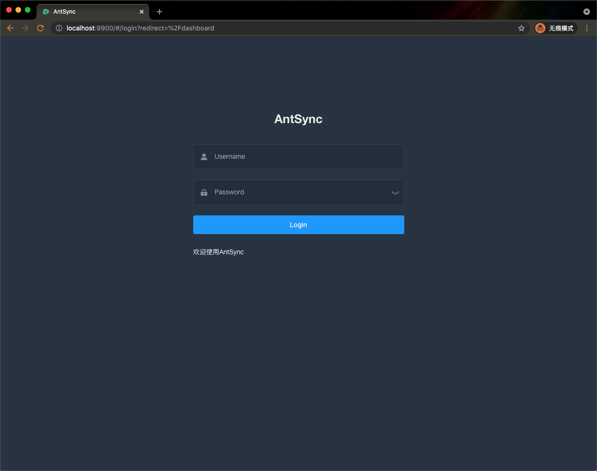

AntSync默认端口是`9900`，打开[localhost:9900](https://localhost:9900)后，提示需要登录才能访问。

登录后，可在首页修改密码。


### 3.1 云端配置

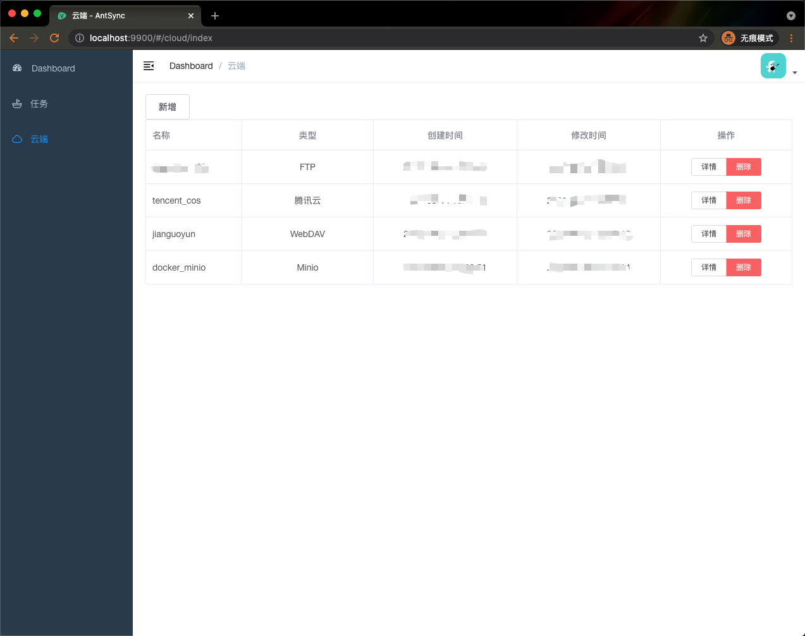

云端指的是远程存储，在配置同步任务前，需要先定义好云端。你可以在云端管理页新增云端，也可以查看、修改已有云端。

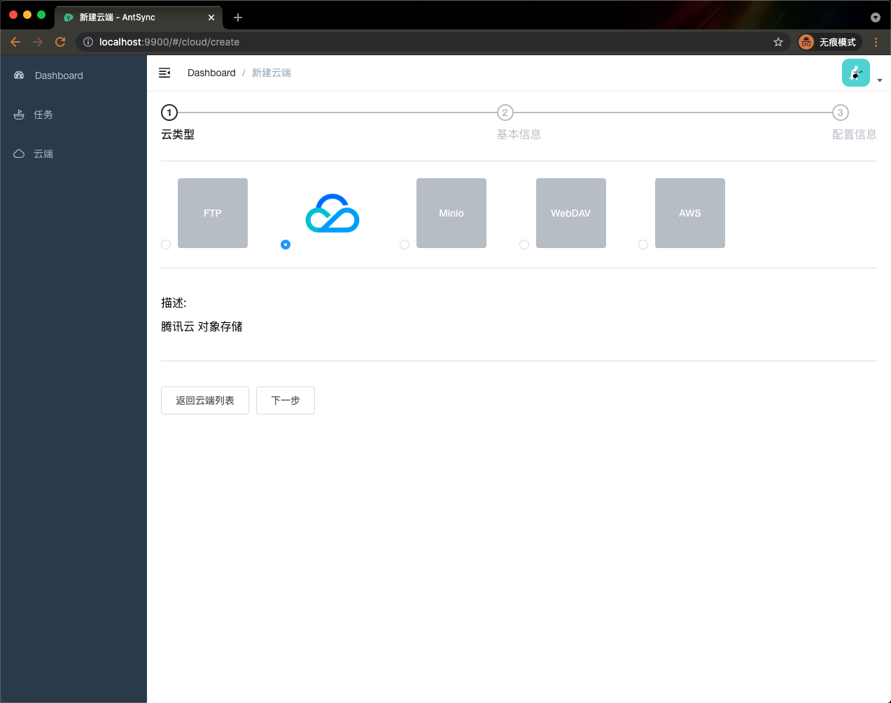

点击新增按钮后，开始新增云端配置。选择需要新增的云端类型，然后点击下一步。

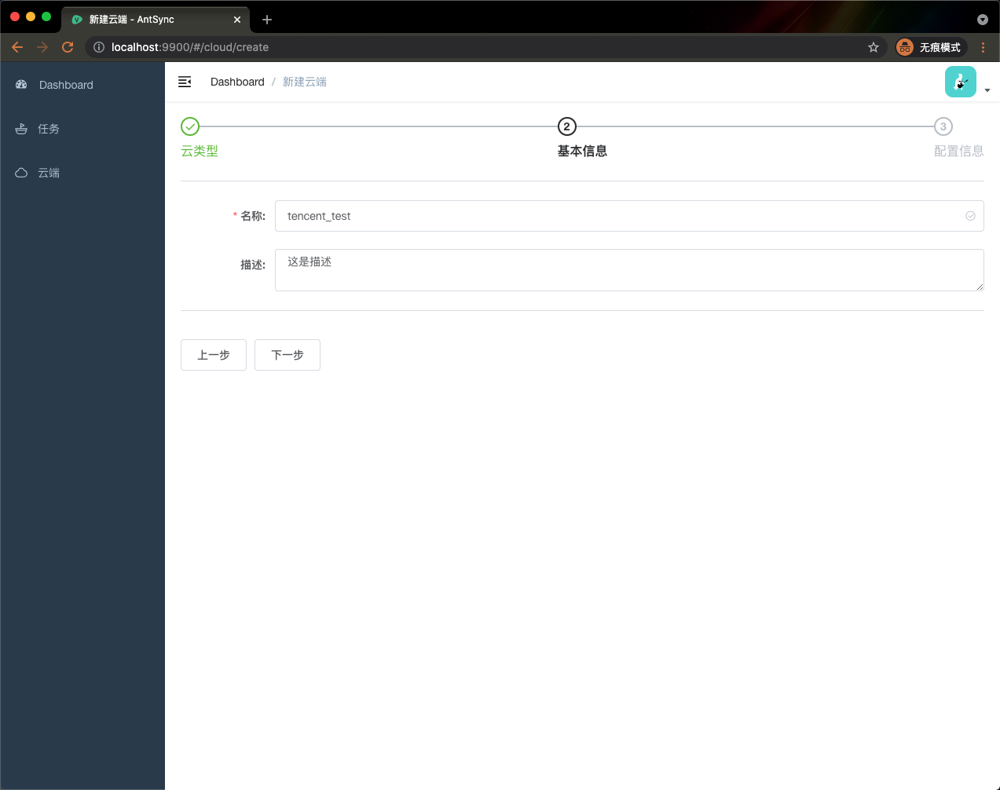

在基本信息配置中填写名称和描述，方便后期管理。

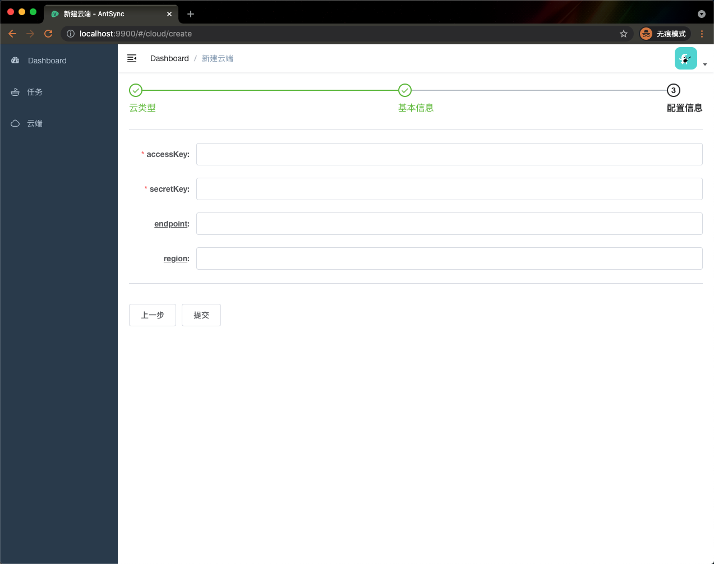

最后，根据选择的云端类型不同，需要填写不同的配置。填写完成后，保存即可。


### 3.2 任务配置

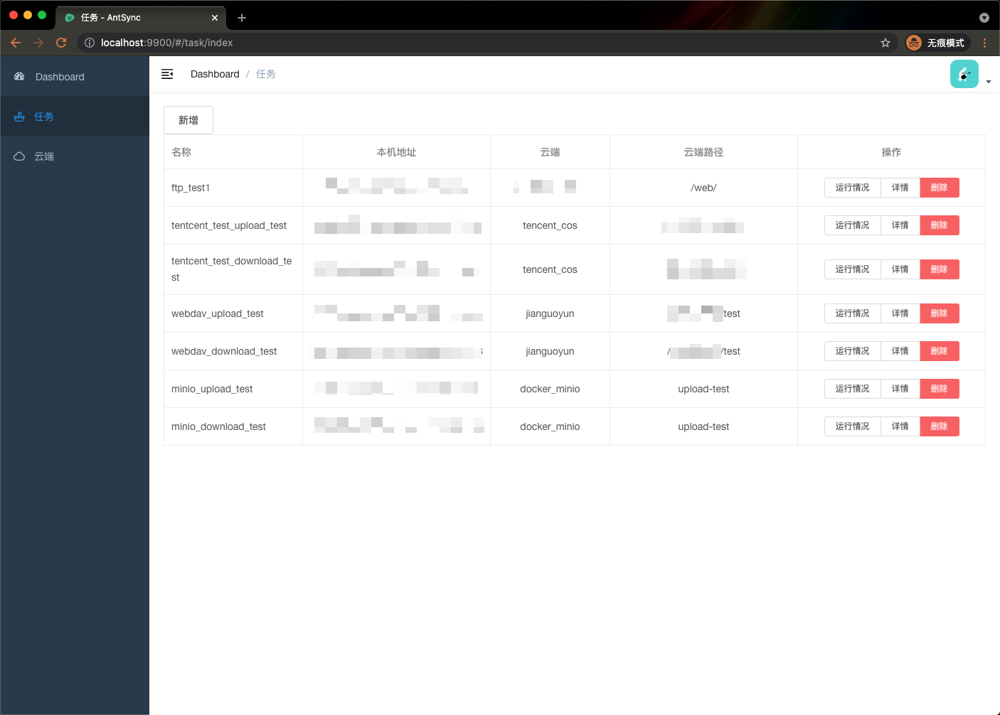

任务是管理本地路径和云端路径同步的基本单位，你可以在任务管理页新增任务，查看应用启动以来的任务运行情况，也可以修改已有任务配置。

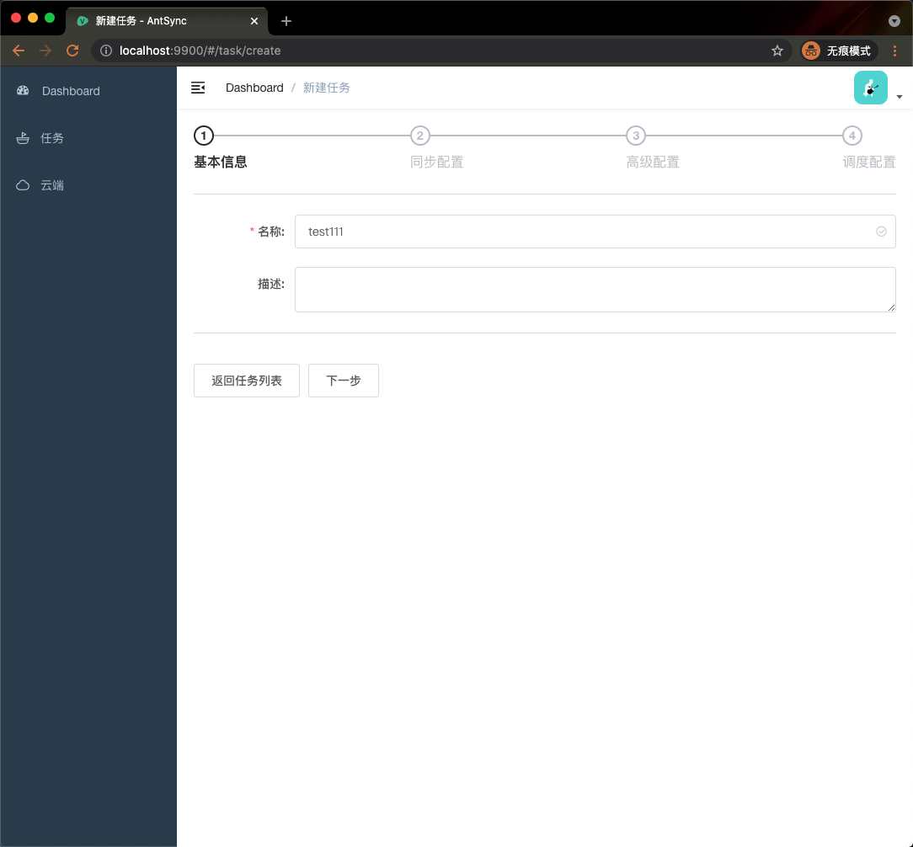

点击新增按钮后，首先给你的任务起一个好听的名字和描述，方便后期管理。


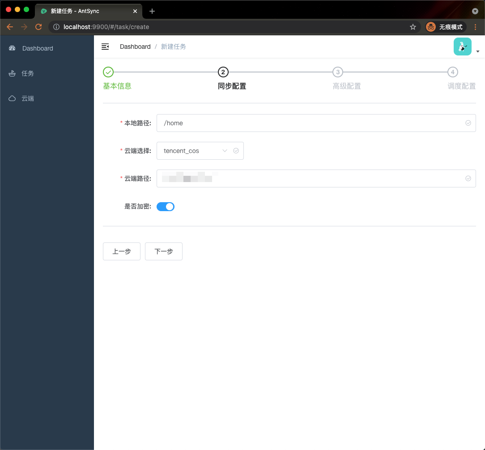

然后进入同步配置，选择本地路径，在填写本地路径时，应用会帮你自动联想当前已有的路径，也只允许填写已有的路径，目录不能以`/`结尾。
选择云端后，在填写云端路径时，应用也会自动联想已有的路径，且只能选择已有的路径。最后，可以选择是否加密。

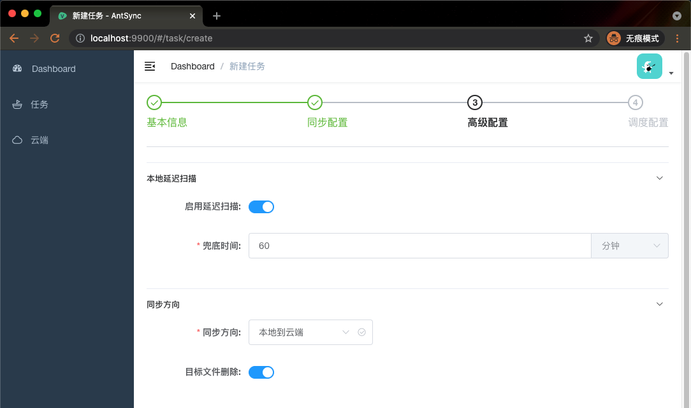

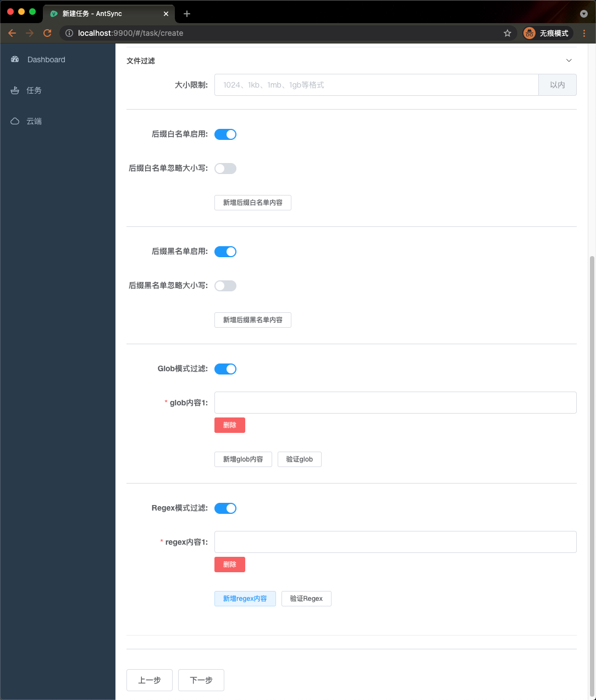

选择好本地路径和云端路径后，进入高级配置。

**1. 本地延迟扫描**

AntSync同步的方式是定时轮询，对于本地文件扫描，当启用延迟扫描后，应用将开始监听本地路径文件变更消息，在下次轮询前如果本地路径下没有文件变更消息，则会跳过本地文件扫描。
同时为了防止漏过文件变更消息，应用允许增加一个兜底时间，即在距离上次正常扫描后超过兜底时间后，将会强制进行正常扫描。

**2. 同步方向**

AntSync支持双向同步，本地到云端同步，云端到本地同步。在选择单向同步后，还支持是否启用目标文件删除，即当被扫描的路径文件被删除后，对应的目标文件是否被删除。

**3. 文件过滤**

AntSync支持多种文件过滤方式。

首先是**大小限制**，可以设置可以同步的文件最大大小。
其次是**后缀白名单**，可以配置希望同步的文件后缀，例如`.png`、`.excel`等等。同时可以配置是否忽略大小写，如果忽略大小写，XXX.PNG这样的文件也会进入名单。
**后缀黑名单**和后缀白名单类似。

**Glob模式过滤**是shell所使用的简化版正则表达式，`.gitignore`使用的就是glob过滤。**Regex模式过滤**是正规的正则表达式。
这两种过滤方式均支持填写后验证，点击验证按钮后，应用会扫描本地路径，找出20条符合该条件的文件，方便验证填写内容是否正确。

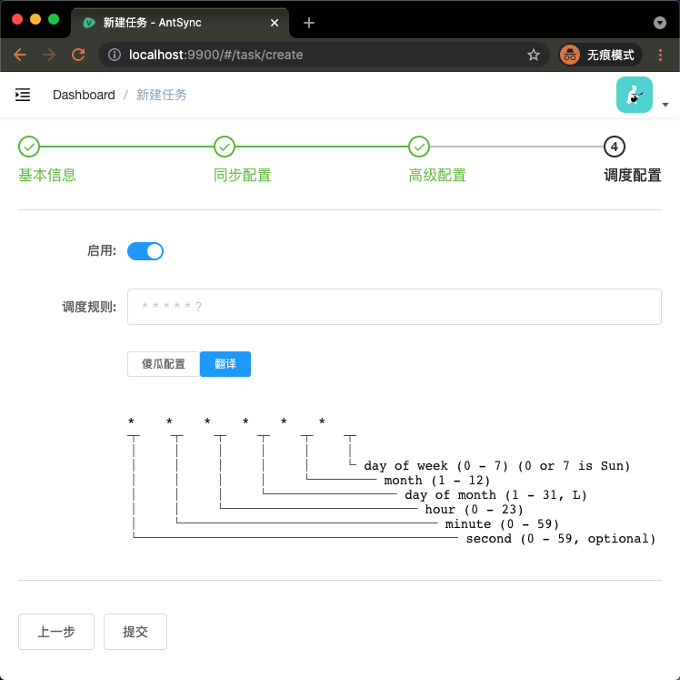

最后，通过启用配置开启同步任务。AntSync采用的是Cron表达式来描述运行间隔时间，Cron表达式可以很灵活地描述大部分运行时间要求。如果你不懂Cron表达式，可以使用傻瓜配置。

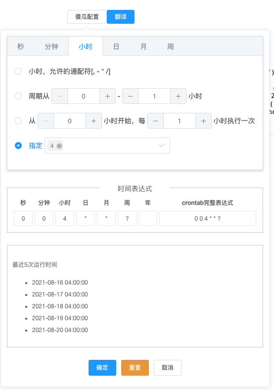

在傻瓜配置中，可以选择你要想同步的时间间隔。随着你的选择，下方会显示最近几次的运行时间。最后，当你填写好调度规则后，可以使用翻译按钮，查看接下来7次运行时刻，用来验证配置是否符合预期。


最后，点击提交按钮完成任务配置。


## 4. 运维

当你的任务配置好后，可以在首页**任务运行情况**卡片中看到任务的总运行情况，也可以在任务管理中查看每个任务的运行情况。

同时，你也可以查看`log/`文件夹下的日志文件来了解当前运行情况。
